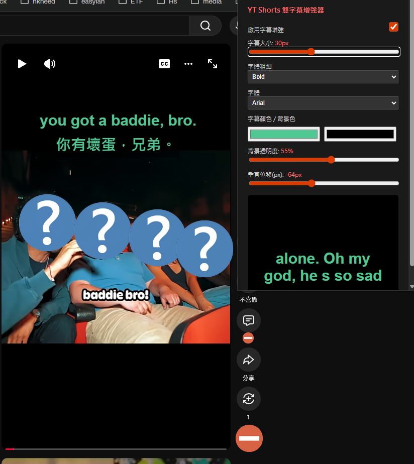

# YT Shorts 字幕增強器

讓 YouTube Shorts 上的 Immersive Translate 雙字幕更大、更清楚、更好讀的 Chromium 擴充功能。

你可以直接用面板調整字幕大小、字重、字型、顏色、背景透明度與上下位置，設定會自動保存，不需要每次重設。



## 這個工具適合誰

如果你常用 YouTube Shorts 學英文、日文、韓文或其他外語，並且已經在使用 Immersive Translate 雙字幕，這個 extension 會特別有幫助。

它主要解決這幾個常見問題：

- 字幕太小，不容易快速讀完
- 字幕貼太下面，容易被介面擋住
- 文字和背景對比不夠，畫面一亮就看不清楚
- 想保留雙字幕，但又想讓畫面更舒服

## 主要功能

- 即時調整字幕大小
- 切換字體粗細
- 切換字型
- 自訂字幕文字顏色
- 自訂字幕背景色與透明度
- 調整字幕上下位置
- 一鍵啟用 / 停用字幕增強
- 設定會自動保存，下次開啟仍可沿用

## 使用前需求

開始之前，請先確認你符合以下條件：

- 使用 Chrome、Edge、Brave 或其他 Chromium 瀏覽器
- 已安裝 Immersive Translate
- 在 YouTube Shorts 頁面上可以正常看到雙字幕

## 安裝教學

第一次安裝也沒關係，照下面做就可以。整個流程大約 3 分鐘。

### 1. 下載這個專案

如果你不會寫程式，推薦直接下載 ZIP：

1. 打開專案頁面：[brian-hsu/yt-shorts-caption](https://github.com/brian-hsu/yt-shorts-caption)
2. 點選頁面上的 `Code`
3. 點選 `Download ZIP`
4. 把下載的壓縮檔解壓縮到一個你找得到、也不會隨手刪掉的資料夾

如果你熟悉 Git，也可以使用：

```bash
git clone https://github.com/brian-hsu/yt-shorts-caption.git
cd yt-shorts-caption
```

### 2. 載入到瀏覽器

1. 打開瀏覽器的擴充功能頁面：Chrome 使用 `chrome://extensions/`，Edge 使用 `edge://extensions/`，Brave 使用 `brave://extensions/`

2. 開啟右上角的 `開發人員模式`
3. 點選 `載入未封裝項目`
4. 選擇你剛剛解壓縮的專案資料夾
5. 確認你選到的資料夾裡面可以直接看到 `manifest.json`
6. 如果列表中出現 `YT Shorts 字幕增強器`，就代表安裝完成

> `開發人員模式` 在這裡只是讓瀏覽器接受本機載入的擴充功能，不代表你需要寫程式。

### 3. 把擴充功能釘選到工具列（推薦）

如果你安裝完後沒看到圖示，可以這樣做：

1. 點瀏覽器右上角的拼圖圖示
2. 找到 `YT Shorts 字幕增強器`
3. 點一下釘選圖示，之後就能直接從工具列開啟

## 快速開始

1. 打開任一 YouTube Shorts 影片
2. 確認 Immersive Translate 雙字幕已經顯示
3. 點擊瀏覽器工具列上的 `YT Shorts 字幕增強器`
4. 依照你的閱讀習慣調整 `字幕大小`、`字體粗細`、`字型`、`字幕顏色 / 背景色`、`背景透明度` 與 `垂直位移`
5. 調整後會即時反映在當前頁面
6. 關掉視窗也沒關係，設定會自動保存

## 權限與隱私

### 需要哪些權限

- `storage`：保存你的字幕偏好設定
- `activeTab`：把面板裡的變更即時套用到目前分頁
- `scripting`：供擴充功能與目前頁面互動時使用
- `https://www.youtube.com/*`：只在 YouTube 頁面啟用

### 不會做的事情

- 不會蒐集個人資料
- 不會把字幕內容傳送到外部伺服器
- 不依賴任何第三方後端服務

## 常見問題

### 我已經安裝了，但看不到效果

請先檢查以下幾件事：

- 你打開的是 `YouTube Shorts`，不是一般 YouTube 長影片頁面
- `Immersive Translate` 的雙字幕已經正常顯示
- 調整設定後有重新回到 Shorts 頁面查看
- 必要時可重新整理頁面，或到擴充功能頁面按一次重新整理

### 為什麼需要開啟「開發人員模式」？

因為這個版本是從本機資料夾直接載入，還不是從 Chrome Web Store 安裝。這是 Chrome / Edge / Brave 的正常安裝方式之一。

### 重新開瀏覽器後，設定會消失嗎？

不會。設定會透過 `chrome.storage.sync` 自動保存。

### 找不到擴充功能圖示怎麼辦？

請點瀏覽器右上角的拼圖圖示，然後把 `YT Shorts 字幕增強器` 釘選到工具列。

## 限制事項

- 目前是針對 Immersive Translate 的字幕結構設計，依賴 `#immersive-translate-caption-window` 與 `.imt-*` 類名
- 如果 YouTube 或 Immersive Translate 更新 DOM 結構，可能需要同步調整程式
- 主要優化場景是 YouTube Shorts，其他 YouTube 頁面不保證效果完全一致

## 開發者補充

### 專案結構

```text
.
├─ manifest.json
├─ popup.html
├─ popup.js
├─ content.js
├─ caption-override.css
├─ icon16.png
├─ icon48.png
├─ icon128.png
└─ docs/images/screenshots/use_yt_short.png
```

### 本機修改後如何測試

1. 修改程式
2. 回到瀏覽器擴充功能頁面
3. 對 `YT Shorts 字幕增強器` 點選重新整理
4. 回到 YouTube Shorts 頁面重新測試

## License

This project is licensed under the MIT License. See [LICENSE](LICENSE) for details.
